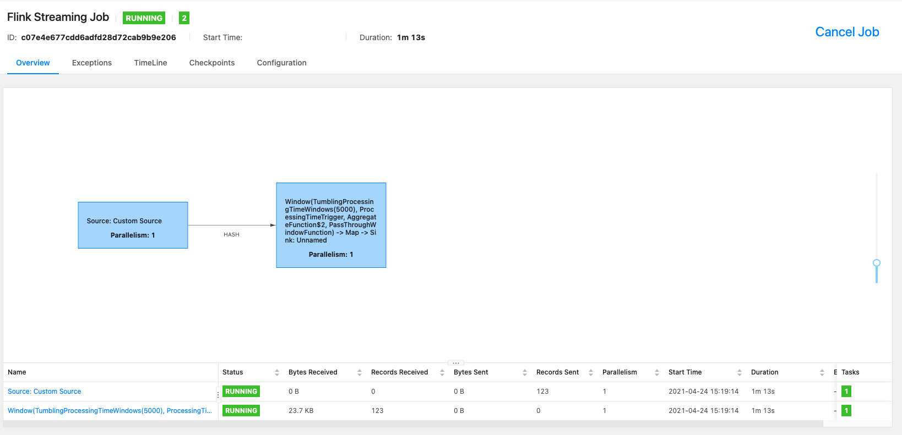
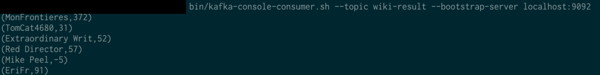

# wiki-edits

## Overview
Toy project that runs a streaming analysis program on a Flink cluster and writes output to Kafka topic.

All implementations follow the tututorial ([Monitoring the Wikipedia Edit Stream](https://ci.apache.org/projects/flink/flink-docs-release-1.0/quickstart/run_example_quickstart.html)) with slight updates on using the more recently published libriraries. 

## Build and Run
Build JAR file
```
mvn clean package
```

### Running to Print Output to Console
Execute main class
```
mvn exec:java -Dexec.mainClass=wikiedits.WikipediaAnalysis
```
### Running on a Cluster and Writing to Kafka

Please make sure that Flink version used in pom.xml is consistent with the one will be used to run Flink cluster. 

Step 0: Get Flink distribution and Kafka

```
flink-1.12.2-bin-scala_2.11.tgz

kafka_2.13-2.8.0.tgz
```

Step 1: Start Flink and the Kafka Environment

Start Flink and check the JobManager’s web frontend at [http://localhost:8081](http://localhost:8081)
```
bin/start-cluster.sh
```

Run the following commands in order to start all Kafka services in the correct order:
```
#  Start the ZooKeeper service
bin/zookeeper-server-start.sh config/zookeeper.properties
```

Open another terminal session and run:
```
# Start the Kafka broker service
bin/kafka-server-start.sh config/server.properties
```

Step 2: Creat Kafka topic
```
bin/kafka-topics.sh --bootstrap-server localhost:9092 --create --topic wiki-result
```

You may check the existing topics by running the following command:
```
bin/kafka-topics.sh --bootstrap-server localhost:9092 --list
```

Step 3: Build JAR and run program on Flink cluster

Run program on Flink cluster
```
bin/flink run -c wikiedits.WikipediaAnalysis target/wiki-edits-0.1.jar
```

Go and check the JobManager’s web frontend at [http://localhost:8081](http://localhost:8081) and you shall see the pogram is up and running.

<p align="center">
  
  <br/>
</p>

You can also observe the output of the program by inspecting the Kafka topic using Kafka console consumer:
```
bin/kafka-console-consumer.sh --bootstrap-server localhost:9092 --topic wiki-result
```

<p align="center">
  
  <br/>
</p>

## References
[Kafka quickstart](https://kafka.apache.org/documentation.html#quickstart)

[setup quickstart for Flink distribution](https://ci.apache.org/projects/flink/flink-docs-release-1.0/quickstart/run_example_quickstart.html)

[Flink proeject configuration](https://ci.apache.org/projects/flink/flink-docs-stable/dev/project-configuration.html)